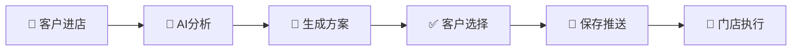

# 🎨 AI Beauty Studio — AI美业智能工具体系平台

<div align="center">


**整合顶级AI大模型能力 · 为美业提供自动化推广方案**

[🌐 在线演示](https://wiondoGit.github.io/ai-beauty-studio/) · [📢 问题反馈](https://github.com/wiondoGit/ai-beauty-studio/issues) · [💬 微信联系](#-联系方式)

</div>

---

## 📖 项目介绍

> **AI Beauty Studio** 是一个专为美业从业者打造的 **一站式AI工具导航与自动化推广方案平台**。
> 
> 平台精选收录了 **15+款核心AI工具**，覆盖图像生成、视频制作、数字人、音乐创作等核心场景，并为 **理发店、美容院、美甲店** 三大美业场景量身定制了自动化推广工作流。

###  为什么需要这个平台？

| 传统美业痛点 | AI Beauty Studio 解决方案 |
|:---|:---|
| 😰 客户进店后沟通成本高，发型师/美容师需要一对一推荐 |  AI自动分析客户特征，一键生成多款方案 |
| 😰 展示效果单一，客户看不到"如果我做这个发型/妆容会怎样" | 🎨 AI实时生成效果预览，所见即所得 |
|  缺乏标准化推广流程，每次服务都是"从零开始" | 📋 预设模板库 + AI自动匹配，形成标准化流程 |
| 😰 社交媒体营销素材制作耗时 | ✨ 内置小红书图文创作、视频生成等工具 |

---

## ✨ 核心功能

### 🛠️ AI工具收藏中心

精心筛选 **15+款** 顶级AI工具，涵盖六大场景：

<div align="center">

| 场景分类 | 工具数量 | 代表工具 |
|:---:|:---:|:---|
| 🚀 **AI平台** *(AI Platform)* | 2款 | 一站式AI大模型入口、无限工作流画布 |
| 🎨 **图像生成** *(Image Generation)* | 4款 | Nano画布、NanoPro文生图、GLM-Image、Z-Image |
| 🎬 **视频生成** *(Video Generation)* | 3款 | Sora2、Sora2去水印、Veo3.1 |
| 🤖 **数字人** *(Digital Human)* | 3款 | Infinitetalk(图/视频)、Heygem |
| 🎵 **音频生成** *(Audio Generation)* | 1款 | Suno AI音乐 |
| 🔧 **实用工具** *(Utility Tools)* | 2款 | 小红书创作、智能去背景 |

</div>

### 💇‍♀️ 三大美业应用场景

#### 场景一：AI发型推荐系统 ️

**适用对象**：理发店、发型师、造型工作室

```
 拍摄客户正面照
    ↓
🤖 AI分析脸型/发质/肤色
    ↓
🎨 自动生成9款最适合发型
    ↓
✅ 客户挑选心仪款式
    ↓
💇‍♀️ 直接执行服务
```

>  **核心价值**：自动生成，无需发型师一对一沟通，**提升3倍接待效率**

#### 场景二：AI妆容定制系统 💄

**适用对象**：美容院、化妆师、美妆工作室

```
📸 面部特征采集
    ↓
🎯 风格/场合偏好选择
    ↓
💄 生成全套妆容方案
    ↓
🛍️ 推荐适合的美妆产品
    ↓
✨ 执行妆容服务
```

> 💡 **核心价值**：标准化妆容咨询流程，**降低沟通成本，提升成单率**

#### 场景三：AI美甲款式推荐 💅

**适用对象**：美甲店、美甲工作室

```
 手部信息采集
    ↓
 季节/场合匹配
    ↓
 生成多款美甲设计
    ↓
🔄 自动替换展示
    ↓
💅 执行美甲服务
```

> 💡 **核心价值**：模板化生成，自动替换，**实现小范围自动化推广**

### 🔄 自动化推广工作流



**完整闭环**：客户进店 → 拍照/选择需求 → AI自动分析 → 生成9款方案 → 客户选择喜欢 → 保存方案 → 自动推送门店 → 门店执行服务

---

## 🚀 快速开始

### 方式一：本地直接使用

```bash
# 1. 下载本项目文件
# 2. 双击 index.html 文件
# 3. 在浏览器中打开即可使用
```

✅ **无需安装任何依赖，即开即用**

### 方式二：在线访问

直接访问 👉 [https://wiondoGit.github.io/ai-beauty-studio/](https://wiondoGit.github.io/ai-beauty-studio/)

### 方式三：部署到自己的服务器

| 平台 | 适用场景 | 费用 |
|:---|:---|:---:|
| GitHub Pages | 个人展示 | 免费 |
| Vercel | 快速部署 | 免费 |
| Netlify | 企业部署 | 免费 |
| 自有服务器 | 完全控制 | 按需 |

---

## 📁 项目结构

```
ai-beauty-studio/
├── index.html              # 主页面（单文件应用 / Single Page Application）
├── README.md               # 项目说明文档
└── .gitignore              # Git忽略文件配置
```

---

## 🎨 技术栈

| 技术 | 用途 | 特点 |
|:---|:---|:---|
| **HTML5** | 语义化结构 | SEO友好，无障碍访问 |
| **CSS3** | 现代样式系统 | CSS变量、Flex/Grid布局、动画 |
| **Vanilla JavaScript** | 原生交互逻辑 | 零依赖，轻量高效 |
| **Google Fonts** | 字体渲染 | Noto Serif SC + Noto Sans SC |

---

## 📝 收录的AI工具详情

### 🚀 AI平台 *(AI Platform)*

| # | 工具名称 | 功能说明 | 链接 |
|:---:|:---|:---|:---|
| 1 | **一站式AI大模型平台** | 顶级AI大模型统一入口，集成多种AI能力 | [oimi.ai](https://oimi.ai) |
| 2 | **全能无限工作流画布** | 可视化AI工作流编排，自由组合AI能力 | [Canvas](https://oimi.ai/zh/canvas) |

### 🎨 图像生成 *(Image Generation)*

| # | 工具名称 | 功能说明 | 链接 |
|:---:|:---|:---|:---|
| 3 | **大香蕉 Nano无限画布** | 创意无限画布，AI辅助设计创作 | [Nano Canvas](https://oimi.ai/zh/nano-banana-canvas) |
| 4 | **大香蕉 NanoPro文生图** | 高质量文字转图片生成器 | [NanoPro](https://oimi.ai/zh/nano-banana-pro) |
| 5 | **GLM-Image文生图** | GLM大模型驱动的图像生成工具 | [GLM-Image](https://oimi.ai/zh/glm-image) |
| 6 | **Z-Image极速生成** | 超快速图像生成，秒级出图 | [Z-Image](https://oimi.ai/zh/z-image) |

### 🎬 视频生成 *(Video Generation)*

| # | 工具名称 | 功能说明 | 链接 |
|:---:|:---|:---|:---|
| 7 | **Sora2 视频生成** | 先进的文本到视频生成工具 | [Sora2](https://oimi.ai/zh/sora2) |
| 8 | **Sora2去水印工具** | 视频秒级去水印，保持画质无损 | [Watermark Remover](https://oimi.ai/zh/sora2/watermark-remover) |
| 9 | **Veo3.1 视频生成** | 新一代视频生成大模型 | [Veo](https://oimi.ai/zh/veo) |

### 🤖 数字人 *(Digital Human)*

| # | 工具名称 | 功能说明 | 链接 |
|:---:|:---|:---|:---|
| 10 | **Infinitetalk 图生数字人** | 单人图片生成数字人视频 | [I2V](https://oimi.ai/zh/InfiniteTalkI2V) |
| 11 | **Infinitetalk 视频生数字人** | 单人视频转换为数字人视频 | [V2V](https://oimi.ai/zh/InfiniteTalkV2V) |
| 12 | **Heygem AI数字人** | 专业AI数字人生成工具 | [Heygem](https://oimi.ai/zh/heygem) |

### 🎵 音频生成 *(Audio Generation)*

| # | 工具名称 | 功能说明 | 链接 |
|:---:|:---|:---|:---|
| 13 | **Suno AI 音乐生成** | AI音乐创作，文字生成完整音乐 | [Suno](https://oimi.ai/zh/suno) |

###  实用工具 *(Utility Tools)*

| # | 工具名称 | 功能说明 | 链接 |
|:---:|:---|:---|:---|
| 14 | **小红书图文创作工具** | 专为小红书平台设计的图文生成工具 | [Xiaohongshu](https://xiaohongshu.oimi.ai) |
| 15 | **智能去除图片背景** | 一键智能抠图，精准去除背景 | [Remove-bg](https://oimi.ai/zh/remove-bg) |

---

## 📸 页面截图

> 平台采用响应式设计，支持桌面端与移动端自适应

<div align="center">

| 桌面端 | 移动端 |
|:---:|:---:|
| 🖥️ 精美卡片式布局 | 📱 自适应小屏幕 |
| 流畅的悬浮动画效果 | 触摸友好的交互 |

</div>

---

## 🎯 适用场景

| 场景 | 适用人群 | 解决痛点 |
|:---|:---|:---|
| 💈 **理发店** | 发型师、造型师 | 快速发型推荐，提升接待效率 |
| 💄 **美容院** | 美容师、化妆师 | 标准化妆容方案，提升成单率 |
| 💅 **美甲店** | 美甲师、美甲店主 | 自动化款式推荐，降低设计成本 |
| 📱 **社交媒体** | 美业自媒体 | 图文/视频素材快速生成 |

---

##  联系方式

| 渠道 | 联系方式 |
|:---|:---|
| 💬 **微信** | `Struggle-in` |
| 🐙 **GitHub** | [wiondoGit](https://github.com/wiondoGit) |
| 📧 **Issue** | [提交问题反馈](https://github.com/wiondoGit/ai-beauty-studio/issues) |

> 💡 如有合作意向、功能建议或问题反馈，欢迎通过 **微信** 或 **GitHub Issue** 联系我！

---

## 📄 开源协议

本项目采用 [MIT License](LICENSE) 开源协议，可自由使用、修改和分发。

---

<div align="center">

**AI Beauty Studio** · 让美业服务更智能、更高效

*整合顶级AI大模型能力，为美业提供一站式自动化解决方案*

⭐ 如果觉得项目有帮助，欢迎 Star 支持！

</div>